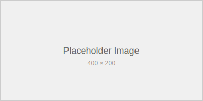

# Advanced Features Demo

This post demonstrates some of the more advanced features available in Krik,
including image handling, complex markdown, and feed generation.

## Image Support

Krik automatically copies images and other static assets to the generated site:



### Image Best Practices

When adding images to your posts:

- Store images in the `content/images/` directory
- Use descriptive filenames
- Include alt text for accessibility
- Optionally include title text for tooltips
- Consider using relative paths from your post location

## Complex Tables

Here's a more complex table showing Krik's architecture:

| Component     | Language | Purpose         | Dependencies          |
| ------------- | -------- | --------------- | --------------------- |
| **Parser**    | Rust     | Markdown → AST  | pulldown-cmark, serde |
| **Generator** | Rust     | AST → HTML      | tera, chrono          |
| **Theme**     | CSS/JS   | Styling & UX    | Native browser APIs   |
| **i18n**      | Rust     | Multi-language  | HashMap collections   |
| **Feed**      | Rust     | Atom generation | XML serialization     |

## Nested Lists and Complex Formatting

### Project Structure

1. **Core Engine** (Rust)
   - Markdown parsing with pulldown-cmark
   - Template rendering with Tera
   - File system operations
2. **Theme System**
   - CSS custom properties for theming
   - JavaScript for interactive features:
     - Theme toggle functionality
     - Footnote navigation
     - Scroll-to-top behavior
   - Responsive design breakpoints
3. **Content Processing**
   - Front matter parsing (YAML)
   - Asset copying (images, files)
   - Language detection from filenames
   - Table of contents generation

### Advanced Markdown Features

#### Mixed Content Types

You can combine different content types effectively:

> **Quote with formatting**: This blockquote contains _italic_, **bold**, and
> `inline code`.
>
> It can also contain lists:
>
> 1. First quoted item
> 2. Second quoted item
>
> And even code blocks:
>
> ```rust
> println!("Code in quotes!");
> ```

#### Code with Explanation

Here's how the theme toggle works:

```javascript
function toggleTheme() {
  // Get current theme or default to light
  const currentTheme =
    document.documentElement.getAttribute("data-theme") || "light";

  // Switch to opposite theme
  const newTheme = currentTheme === "light" ? "dark" : "light";

  // Apply new theme
  document.documentElement.setAttribute("data-theme", newTheme);

  // Save preference
  localStorage.setItem("theme", newTheme);

  // Update toggle icon
  updateThemeIcon(newTheme);
}
```

The key aspects of this implementation:

- Uses `data-theme` attribute on the root element
- Leverages localStorage for persistence
- Provides smooth CSS transitions
- Works across page reloads

## SEO and Discovery Features

Krik automatically generates several files to optimize search engine discovery and indexing:

### Atom Feed Generation

Automatically generates an Atom feed (`feed.xml`) that includes:

#### Feed Metadata

- Site title from `site.toml`
- Last updated timestamp
- Self-referencing links
- Unique feed ID

#### Post Entries

- Only posts (not pages) are included
- Limited to 20 most recent posts
- Full HTML content with proper escaping
- Individual post IDs and timestamps
- Tag information (when available)

#### Link Resolution

When `base_url` is configured in `site.toml`, Krik uses the `xml:base` attribute
for proper link resolution:

```xml
<feed xmlns="http://www.w3.org/2005/Atom" xml:base="https://example.com">
```

This ensures that relative links in your posts work correctly when viewed in
feed readers.

### XML Sitemap Generation

Automatically generates a comprehensive XML sitemap (`sitemap.xml`):

#### Sitemap Features

- **XML Schema Validation**: Includes proper namespace declarations
- **Multilingual Support**: Uses `<xhtml:link>` for alternate language versions
- **Canonical URLs**: One entry per content piece (prefers English)
- **SEO Optimization**: Proper priorities and change frequencies
- **Draft Exclusion**: Automatically excludes draft content

#### Example Sitemap Entry

```xml
<url>
  <loc>https://example.com/posts/welcome.html</loc>
  <lastmod>2024-01-15</lastmod>
  <changefreq>monthly</changefreq>
  <priority>0.8</priority>
  <xhtml:link rel="alternate" hreflang="en" href="https://example.com/posts/welcome.html" />
  <xhtml:link rel="alternate" hreflang="it" href="https://example.com/posts/welcome.it.html" />
</url>
```

### robots.txt Generation

Automatically generates SEO-optimized robots.txt:

#### robots.txt Features

- **Sitemap Reference**: Points to sitemap.xml location
- **Best Practice Rules**: Allows content while blocking system files
- **Bot Management**: Specific rules for major search engines
- **Security**: Blocks known problematic crawlers
- **Politeness**: Includes crawl delay settings

#### Example robots.txt

```
User-agent: *
Allow: /

# Disallow common non-content directories
Disallow: /.*
Disallow: /_*

# Sitemap location
Sitemap: https://example.com/sitemap.xml

# Crawl delay (optional - be nice to servers)
Crawl-delay: 1
```

## Performance Considerations

### Build Performance

Krik is designed for speed:

- **Rust Performance**: Native speed with zero-cost abstractions
- **Parallel Processing**: Multi-threaded where possible
- **Incremental Building**: Only processes changed files (planned feature)
- **Memory Efficiency**: Streaming processing for large sites

### Runtime Performance

The generated sites are optimized for performance:

- **Minimal CSS**: No framework bloat, only necessary styles
- **Progressive Enhancement**: JavaScript enhances but isn't required
- **Responsive Images**: Proper sizing and format recommendations
- **Static Assets**: Everything is static, no server-side processing

## Accessibility Features

Krik generates accessible HTML by default:

### Semantic Structure

- Proper heading hierarchy (H1 → H2 → H3)
- Landmark elements (nav, main, aside)
- List structures for navigation

### Interactive Elements

- ARIA labels on buttons and controls
- Focus indicators for keyboard navigation
- Skip links for screen readers (planned)

### Content Accessibility

- Alt text support for images
- Table headers and captions
- High contrast color schemes

---

This demonstrates many of Krik's advanced capabilities. The combination of
performance, features, and accessibility makes it an excellent choice for modern
static sites.
